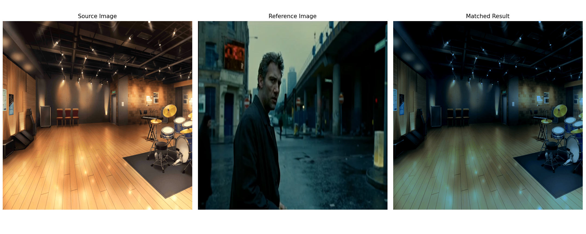
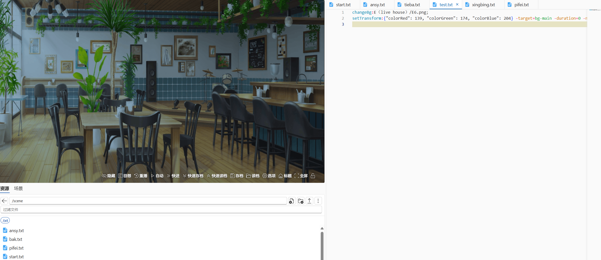
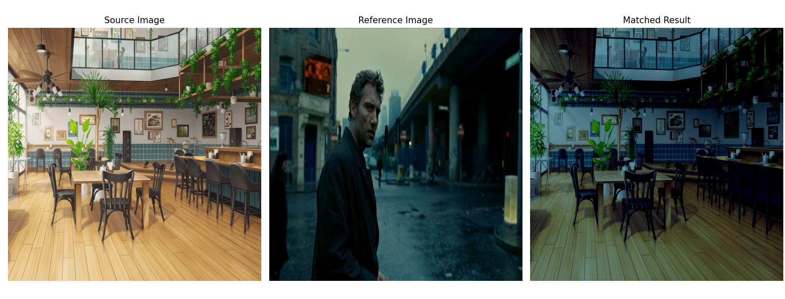

# 🎉 [gen_model](https://github.com/KonshinHaoshin/gen_model)

> 如果你觉得这个工具对你有帮助，欢迎关注 B 站 UP 主 **东山燃灯寺**！  
> 💖 你的支持是我持续改进的动力！  
> 🔗 B 站链接：[https://space.bilibili.com/296330875](https://space.bilibili.com/296330875?spm_id_from=333.1007.0.0)

✨ 本项目是一个专为 **Live2D Cubism 2 SDK 模型** 开发的资源管理与自动化工具，帮助用户轻松创建、更新并批量整理 `model.json` 配置文件，极大地减少手动编辑负担。

> ⚠️ 本工具**仅支持 Cubism 2 时代的模型结构**。

---

## 🔥 主要功能

### 1. ✅ 生成 `model.json`

- 自动扫描指定的 Live2D 模型目录，生成标准格式的 `model.json`。
- 自动分类并导入：
  - `.moc` 模型文件
  - `.physics.json` 物理配置
  - `.png` 贴图纹理
  - `.mtn` 动作
  - `.exp.json` 表情文件

### 2. ➕ 添加单个动作或表情

- 向已有的 `model.json` 添加单个 `.mtn` 或 `.exp.json` 文件。
- 自动路径相对化，方便跨平台使用。

### 3. 📦 批量添加动作或表情

- 支持输入一个文件夹或多个文件路径（用 `;` 分隔）进行批量导入。
- 可自定义名称前缀，便于组织管理。

### 4. 🧹 去重 + 删除无效路径（全新功能！）

- 自动检测并去重 `model.json` 中的重复动作/表情。
- 自动检测文件是否实际存在，**集中列出所有缺失项**，并询问是否一键删除对应记录。
- 自动备份原始 `model.json` 为 `.bak` 文件。

### 5. 🛠 批量修改 `.mtn` 文件中的 `PARAM_IMPORT` 参数

- 快速替换指定目录下所有 `.mtn` 文件中的 `PARAM_IMPORT` 值，用于调整动作权重或合成行为。

---

## 🚀 使用方法

1. **运行 `live2d_tool.py`**：

   ```bash
   python live2d_tool.py
   ```

2. **根据菜单提示选择功能**：

   ```
   1. 生成新的 model.json
   2. 添加单个动作/表情到 model.json
   3. 批量添加动作/表情到 model.json
   4. 去重 model.json 中重复的动作/表情，并删除不存在的路径
   5. 批量更改 mtn 文件中的 PARAM_IMPORT 参数
   q. 退出程序
   ```

3. **按照提示输入文件路径、参数等信息**，等待程序执行完成。

---

## 📂 推荐文件结构（示例）

```
your_model_folder/
├── model.moc
├── model.json
├── physics.json
├── texture_00.png
├── idle.mtn
├── happy.exp.json
└── ...
```

---

## 💡 小贴士

- 使用前请备份模型目录，避免误操作。
- 工具默认会对 `model.json` 进行 `.bak` 备份，放心修改。
- 建议在模型制作后期使用本工具进行资源整理与批量修复。

## 🎨 新功能：`color_transfer.py` — 图像色调匹配 & WebGAL 色调指令生成

> 快速将一张图像的整体色调迁移为另一张图像的风格，并自动生成 WebGAL 使用的 `setTransform` 指令！

------

### 🔧 功能介绍

- 对比源图与参考图的 RGB 色彩分布，自动生成“匹配风格”的新图像。
- 自动构造 WebGAL 指令：根据参考图相对于源图的亮度差异，生成精确的 `colorRed` / `colorGreen` / `colorBlue` 参数。
- 支持交互式选择图像，输出图像自动保存并可视化预览。

------

### 📦 使用方式

1. 将源图像（需要调整风格）准备好；

2. 将参考图像放入 `png/` 文件夹（支持多个 .png）；

3. 运行安装依赖

   ```bash
   pip install pillow numpy matplotlib
   ```

4. 运行

   ```bash
   python color_transfer.py
   ```

5. 按照命令行提示操作：

6. 程序将输出：

   - 一张新的色调匹配图：保存在 `output/` 文件夹中；
   - 一条 WebGAL 可用的 `setTransform` 指令，直接复制使用。

### 📌 示例输出

```bash
✅ Color matching done. Saved to: output/matched_background_cool.png

🎬 Suggested WebGAL Transform Command:
setTransform:{"colorRed": 130, "colorGreen": 210, "colorBlue": 255} -target=bg-main -duration=0 -next;
```

### 🔄 数学原理：**标准化 + 分布转换**

这一步是核心：

1. 将源图的每个像素先标准化为 **零均值单位方差**

   ```math
   z=x−μsrcσsrcz = \frac{x - \mu_{\text{src}}}{\sigma_{\text{src}}}z=σsrcx−μsrc
   ```

   

   

2. 再重构为目标图的分布：

   ```math
   xnew=z⋅σtgt+μtgtx_{\text{new}} = z \cdot \sigma_{\text{tgt}} + \mu_{\text{tgt}}xnew=z⋅σtgt+μtgt
   ```

   

这相当于将源图的色彩分布“平移+拉伸”为参考图的色彩分布。

即对每个 RGB 通道：

- 将源图像的亮度“拉平”为标准分布；
- 然后再“拉回”成目标图的风格。

 🧠 WebGAL 色调分析：

每个通道（R/G/B）默认值为 `255`，程序将根据参考图的相对亮度变化与源图进行对比，输出：

```python
colorX = 255 - (source_mean - target_mean)
```

并保证结果范围在 `[0, 255]`，自动向 WebGAL 样式靠拢。

### ✅ 示例






> ```webgal
> changeBg:E（live house）/E6.png;
> setTransform:{"colorRed": 139, "colorGreen": 174, "colorBlue": 204} -target=bg-main -duration=0 -next;
> ```




## 🎭 拼好模 JSONL 文件格式说明

本文件为 `.jsonl` 格式（每行一个 JSON 对象），用于描述多个 **Live2D 模型子部件** 及其资源路径，并统一组合为一个虚拟角色立绘，同时提供动作（motions）与表情（expressions）列表，供引擎使用。

### 📦 文件结构示例

```json
{"index": 0, "id": "myid0", "path": "1.头发/model.json", "folder": "1.头发"}
{"index": 1, "id": "myid1", "path": "2.身体/model.json", "folder": "2.身体"}
{"index": 2, "id": "myid2", "path": "3.脸/model.json", "folder": "3.脸"}
{"index": 3, "id": "myid3", "path": "4.其他/model.json", "folder": "4.其他"}
{"motions": ["idle01", "smile01"], "expressions": ["default", "angry01"]}
```

### 🧩 字段说明

| 字段名        | 类型   | 描述                                                         |
| ------------- | ------ | ------------------------------------------------------------ |
| `index`       | int    | 模型部件在组合中的顺序（用于排序）                           |
| `id`          | string | 每个部件的唯一 ID（通常由 `prefix + index` 构成）目前无实际含义 |
| `path`        | string | 指向每个部件的 `model.json` 路径（相对路径）                 |
| `folder`      | string | 部件所在子目录名称（可用于展示或资源管理）                   |
| `motions`     | array  | ✅**仅出现在最后一行**，表示所有部件都支持的 **共通动作** 名称列表 |
| `expressions` | array  | ✅**仅出现在最后一行**，表示所有部件中至少有一个支持的表情名称列表 |

### 🧠 在Eastmount系列引擎中运行逻辑概述

1. **解析 `.jsonl` 文件**
   - 读取每一行 JSON；
   - 获取每个部件的 `path` 字段，拼接为完整路径；
   - 过滤掉非模型路径（如 summary，即最后一行存放动作表情）。
2. **加载模型并添加至容器**
   - 通过 `this.live2DModel.from(modelPath)` 异步加载每个 `model.json`；
   - 调整缩放、锚点、位置等属性；
   - 添加至统一的 `WebGALPixiContainer` 中，实现跟其他立绘一样的打光、移动效果。
3. **统一设置动作与表情**
   - 如果 `webgalStore` 中有之前设置的 motion/expression 则自动应用；
   - 所有模型播放同一个动作；
   - 同步表情切换；
   - 禁用自动眨眼，避免不同部件重复闪烁。
4. **加入舞台与状态注册**
   - 将组合容器加入 `figureObjects` 列表；
   - 注册 UUID 与 source 路径；
   - 延迟显示容器（0.1秒 alpha 渐变）。

### 🧠 使用场景

目前支持，**且**仅在·`Eastmount`系列引擎中支持

## 📜 License

本项目遵循 MIT 协议，欢迎自由使用、修改和分发。

---

如需自动化脚本、图形界面或与 Live2D Viewer 配套使用的功能，欢迎发起 Issue 或 PR！  
有更多想法也欢迎联系我，我会持续维护和优化。


```bash
 pyinstaller -w -F main_ui.py --icon=icon.ico --name Live2DToolbox --add-data "style.qss;." --add-data "icon.png;."                                  
                                                                                    
```